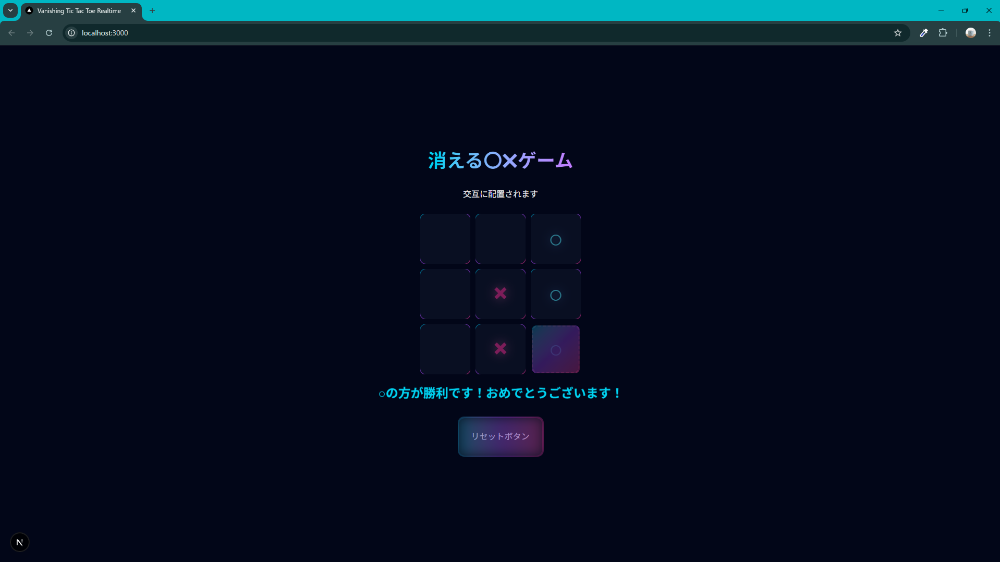

# 消える○×ゲーム（Vanishing Tic-Tac-Toe）

<div align="center"><a href="#en">🇺🇸 English Description</a></div>

---

<a id ="jp"></a>


## 🚀 デモ (demo)

**実際に遊べます！！下記をクリックしてください**👇

[https://tic-tac-toe-client-brp5.onrender.com](https://tic-tac-toe-client-brp5.onrender.com/)

※ PC,スマホ、ブラウザでも別タブ同士で対戦が可能です

## 📷 スクリーンショット




Youtube shortsで見かけた「時間が経つと自動で消える〇×ゲーム」のゲーム機を
ブラウザ上で再現したリアルタイム対戦ゲームです。
通常の〇×ゲームに消失要素を加えることで、読み合いも必要になる心理戦の要素を取り入れました。

## 🎮 ゲームのルール  (Features)

-  **最大コマ数**：3コマです。それ以上のコマを置くことはできません。
-  **消失ギミック**：4コマ目を置いた時点で一番最初に置いた自分のコマが自動で消えます。
-  **リアルタイム対戦**：リンクを送れば送った相手と対戦可能です。(1人で動作確認をしたい場合は別タブで開くことで対戦の再現が可能です)
- **勝敗条件**：縦、横、斜めに自分のコマを3つ並べた時点で勝利としています。

## 🛠️ 技術スタック  (Tech Stack)

- **Frontend**：Next.js,  TypeScript,  Tailwind css
- **Backend** ：Express.js,Node.js
- **Realtime**：Socket.io(双方向通信)
- **Deployment**：Render.com

## 🚪 開発環境のセットアップ  (Local Setup)

下記は手元で動かすための手順です。
### 1. リポジトリのクローン

```
bash

$ git clone https://github.com/IT-imataka/tic-tac-toe-realtime.git
$ cd tic-tac-toe-realtime
```

### 2. バックエンドの起動

```
bash

$ cd server
$ npm install

# 開発モードで起動
$ npm run dev
```

### 3. フロントエンドの起動

*ターミナルウィンドウを分けて実行してください*

```
bash

$ cd client
$ npm install

# 環境変数の設定
# .env.localファイルを作成して、下記を記載
NEXT_PUBLIC_API_URL = http://localhost:3001

$ npm run dev
```


## 💡 工夫した点・苦労した点

- **リアルタイム通信**：今回はリアルタイム対戦ということでマークを置いた時に即座に伝えたいと思い、WebSocketを用いました。
  
- **アーキテクチャ**：フロントエンドにReactベースのNext.jsを用いることで、マス目の状態をStateとして保存し、クライアント・サーバー間で疎結合な構成を目指しました。
  
- **デプロイ**：バックエンドも含めたポートフォリオは初めてだったので、corsなどの設定や、ビルド時の設定に苦労しました。
  
- さらにオリジナリティな部分として、一定個数以上はマークが消えるというギミックを実装したため、その状態管理の考え方が難しく、geminiと撃ち合いました。
<a id ="en"></a>
# 🌐 English_description

# Vanishing Tic-Tac-Toe


## 🚀 Demo

**Play it now!! Click below**👇

[https://tic-tac-toe-client-brp5.onrender.com](https://tic-tac-toe-client-brp5.onrender.com/)

※ You can play against others on PC, smartphone, or browser using separate tabs

## 📷 Screenshot


This is a real-time multiplayer game recreating the “Tic-Tac-Toe that automatically disappears over time” game console seen on YouTube Shorts, now playable in your browser.
By adding a disappearing element to classic Tic-Tac-Toe, it incorporates psychological warfare where reading your opponent becomes crucial.

## 🎮 Game Rules (Features)

-  **Maximum Pieces**: 3 pieces. You cannot place more than 3 pieces.
-  **Disappearance Mechanism**: Placing the fourth piece automatically erases your very first piece.
-  **Real-Time Multiplayer**: Send a link to play against anyone. (To test alone, open in a separate tab to simulate a match.)
-  **Win Condition**: Win by aligning three of your pieces vertically, horizontally, or diagonally.

## 🛠️ Tech Stack

- **Frontend**: Next.js, TypeScript, Tailwind CSS
- **Backend**: Express.js, Node.js
- **Realtime**: Socket.io (bidirectional communication)
- **Deployment**: Render.com

## 🚪 Local Setup

Below are the steps to run the project locally.
### 1. Clone the Repository

```
bash

$ git clone https://github.com/IT-imataka/tic-tac-toe-realtime.git
$ cd tic-tac-toe-realtime
```

### 2. Start the Backend

```
bash

$ cd server
$ npm install

# Start in development mode
$ npm run dev
```

### 3. Start the Frontend

*Please run this in a separate terminal window*

```
bash

$ cd client
$ npm install

# Set environment variables
# Create a .env.local file and add the following:
NEXT_PUBLIC_API_URL = http://localhost:3001

$ npm run dev
```


## 💡 Key Innovations and Challenges


- **Real-time Communication**: Since this was a real-time multiplayer game, I wanted to transmit marker placement instantly, so I used WebSockets.

- **Architecture**: By using React-based Next.js for the frontend, I aimed for a loosely coupled structure between client and server by storing the grid state as State.

- **Deployment**: Since this was my first portfolio project including the backend, I struggled with settings like CORS and build configuration.

- As an additional original feature, I implemented a mechanic where marks disappear once a certain number is reached. Managing this state proved challenging, and I battled with Gemini.

<div align="right"><a href ="#jp">Back to top👆</a></div>
